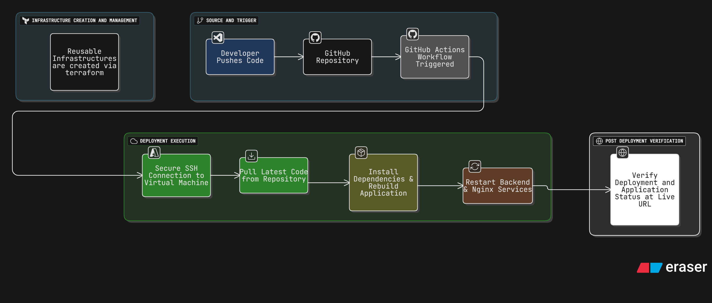

# Staunch - Cloud & DevOps
This documentation explains my role and contributions as a Cloud & DevOps Engineer at Staunch, where I designed and implemented CI/CD pipelines for multiple projects using GitHub Actions and VM-based deployments.

## Overview
- Developed automated CI/CD pipelines for various projects at Staunch.
Whenever the development team pushes new code to the GitHub repository, the respective pipeline is triggered, and the updated code is deployed automatically to the connected virtual machine (VM).

- All sensitive credentials and configuration files are securely managed using GitHub Secrets, ensuring a safe and compliant deployment process.
The pipeline status and logs are continuously monitored via the GitHub Actions dashboard to verify workflow success and identify issues in real time.

- Each pipeline includes security checks, validation steps, and service restarts to ensure consistent and reliable deployment across environments.
After every deployment, the project’s live status is verified through the respective hosted URL.

- Initial cloud infrastructure — including virtual machines, networking, and base environment setup — was provisioned using Terraform. Once infrastructure creation was completed, all subsequent deployments and updates were managed entirely via GitHub Actions, connecting directly to the configured VMs for application-level automation.

## Key Highlights
- Designed end-to-end CI/CD workflows using GitHub Actions.

- Implemented automated deployment to cloud VMs (AWS & Azure) via SSH.

- Configured environment variables, secret keys, and access tokens for secure runtime execution.

- Integrated validation and rollback mechanisms to prevent failed deployments.

- Achieved zero manual intervention during production pushes.

- Applied Terraform for one-time infrastructure provisioning and baseline environment setup.

## Tech Stack

| Category | Tools & Services |
|-----------|------------------|
| Cloud Platforms | AWS, Azure |
| CI/CD Platform | GitHub Actions |
| Infrastructure | Terraform, Linux VM |
| Security | GitHub Secrets, SSH Keys |
| Monitoring | GitHub Actions Logs, URL Validation |
| Tools | Nginx, Systemd, Bash, YAML |

## Workflow Diagram

## Outcome

- Reduced deployment time from manual to fully automated pushes.

- Improved workflow reliability with built-in validation and error handling.

- Enhanced deployment visibility using GitHub Actions monitoring and logs.

- Delivered a scalable, secure, and maintainable DevOps pipeline for multiple active projects.

- Established a reusable cloud deployment foundation with Terraform and CI/CD integration.
